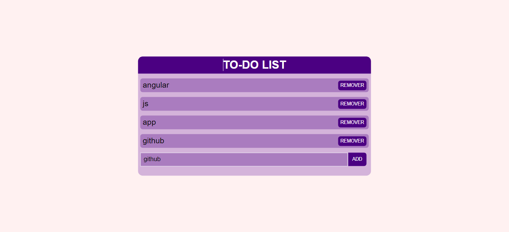

## 🚀 TO-DO List Angular JS

## 🛠️ Construído com

## ✒️ Autores

* **Dev** - *Trabalho Inicial e final* - [pequenofx](https://github.com/pequenofx)

## 📄 Licença

©Todos os direitos reservados 

## 🎁 Considerações finais

* Aprendendo a usar Angular JS basico!! 
* Aprendi muito com esse projeto, sempre buscando evolução cada dia mais📢

---
⌨️ com ❤️ por [pequenofx](https://gist.github.com/pequenofx) 😊
